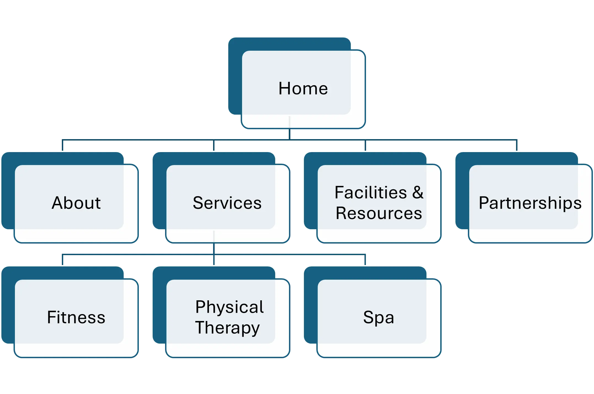
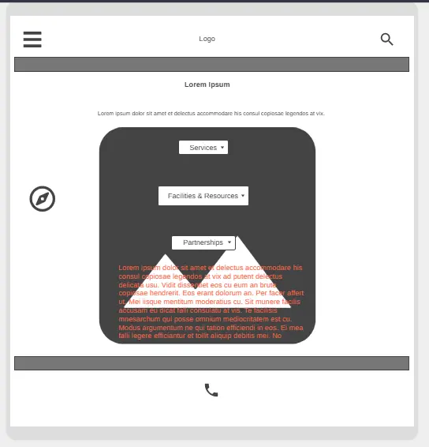
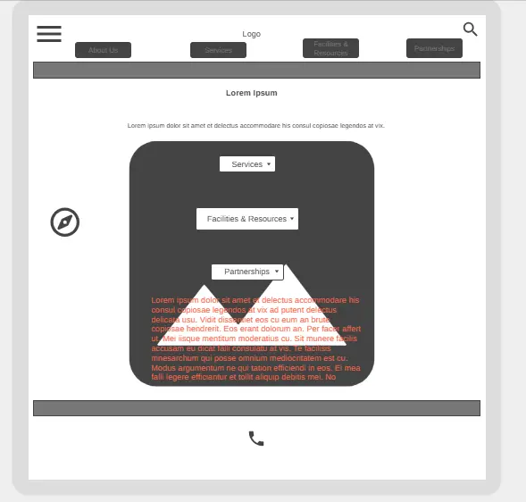
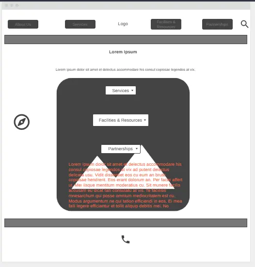
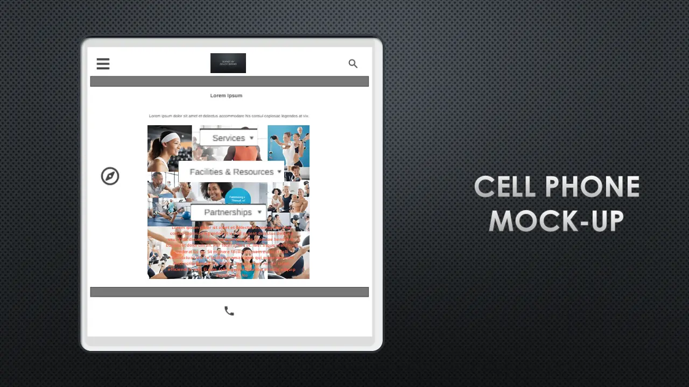
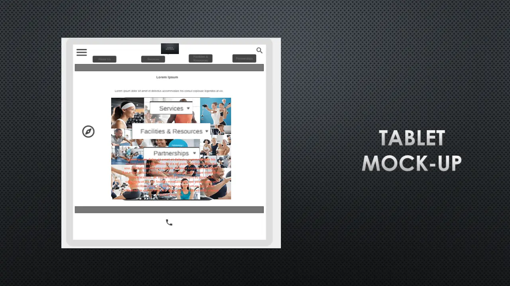
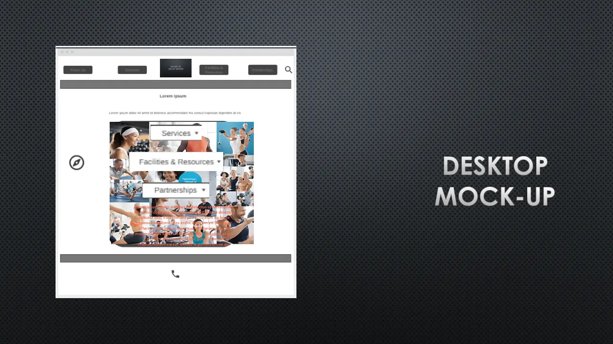

# Bodies By Beach Bodies

## React & Next.js

This project is built using **React** for component-based UI development and **Next.js** for advanced routing, server-side rendering (SSR), and static site generation (SSG). Next.js enables both dynamic and static deployments, making it ideal for modern web applications and static hosting platforms like GitHub Pages.

- **React**: Provides the foundation for building reusable UI components and managing state.
- **Next.js**: Handles routing, SSR/SSG, and static export. For GitHub Pages, the site is exported as static HTML, CSS, and JS files using ~~`next export`~~ `next build`.

### Static Export for GitHub Pages

To deploy on GitHub Pages, use the following steps:

1. **Build and Export**
   ```bash
   npm run build
   ~~npm run export~~
   ```
   This generates a static `out/` directory with all HTML, JS, and assets.
   
   If your project is configured to export to `docs/`, use that folder instead of `out/` in the steps below.

2. **Deploy**
   - Copy the contents of the `out/` (or `docs/`) directory to your `gh-pages` or `feature/gh-pages` branch.
   - Commit and push the changes.
   - GitHub Pages should be configured to serve from the `/docs` folder or the root of the deployment branch.
   - **All image and asset paths should be relative (e.g., `img/Logo.webp`) for static hosting.**

3. **Test Locally**
   To preview your static export locally before deploying:
   ```bash
   npx serve out
   # or
   npx serve docs
   ```
   Then visit the local URL shown in your terminal.

4. **Limitations**
   - Only static features are supported on GitHub Pages. API routes and server-side logic will not work.
   - Use static data or mock APIs for demonstration purposes.
   - All asset references (images, CSS, etc.) must use relative paths (e.g., `img/Logo.webp` not `/img/Logo.webp`).

---

This document outlines the development details for Bodies By Beach Bodies following best practices for a Single-Page Application (SPA) built with a modern JavaScript tool stack.

## Table of Contents

*   [Project Overview](#project-overview)
*   [Technologies Used](#technologies-used)
    *   [Core Technologies](#core-technologies)
    *   [Development and Build Tools](#development-and-build-tools)
    *   [Development Environment](#development-environment)
    *   [Wireframing and Design Tools](#wireframing-and-design-tools)
        *   [Image Formats](#image-formats)
*   [Design Documentation](#design-documentation)
    *   [Visual Aids](#visual-aids)
        *   [Flowchart](#flowchart)
        *   [Wireframes](#wireframes)
        *   [Mock-Up Creation](#mock-up-creation)
        *   [Creating a Mock-Up with HTML](#creating-a-mock-up-with-html)
*   [Project Structure](#project-structure)
    *   [HTML Components](#html-components)
    *   [Document Object Model (DOM)](#document-object-model-dom)
    *   [Application Shell](#application-shell)
    *   [Route Based Components](#route-based-components)
    *   [UI Components](#ui-components)
*   [Client-Side Storage (localStorage/sessionStorage)](#client-side-storage-localstorage-sessionstorage)
*   [Development Workflow](#development-workflow)
*   [Accessibility](#accessibility)
*   [SEO](#seo)
*   [Responsive Design](#responsive-design)
*   [Contributing](#contributing)
*   [License](#license)
*   [Getting Started](#getting-started)
    *   [Learn More](#learn-more)
    *   [Deploy on Vercel](#deploy-on-vercel)
*   [About This Branch (`feature/gh-pages`)](#about-this-branch-featuregh-pages)
*   [Build & Deployment Scripts](#build--deployment-scripts)
*   [Additional Notes for GitHub Pages Deployment](#additional-notes-for-github-pages-deployment)
*   [Troubleshooting GitHub Pages Deployment](#troubleshooting-github-pages-deployment)
*   [Branch Management](#branch-management)
*   [Contact Form Adaptation for GitHub Pages](#contact-form-adaptation-for-github-pages)
*   [Retrieving Contact Form Data](#retrieving-contact-form-data)

## Project Overview

This project is a single-page application designed for a personal trainer at `Bodies By Beach Bodies` to help attract clients and showcase their expertise. It includes a focus on a mobile-first design, performance optimization, and accessibility, with global reach in mind. It has an emphasis on making a client feel comfortable using the site as well as providing information about all offerings. It includes an extensive partnership page designed to recruit stakeholders. The project is designed to be test-driven and object oriented, making it easy to debug and scale in the future.

## Technologies Used

### Core Technologies

*   **Front-End Framework:**
    *   **React with Next.js**
        *   For building the user interface with server-side rendering (SSR) and static site generation (SSG).
*   **Styling:**
    *   **Tailwind CSS**
        *   For modern, responsive, and customizable styling.
*   **Database:**
    *   **MongoDB**
        *   For storing and managing data, such as user information, service details, and appointment schedules.  Utilizing MongoDB Atlas can provide a scalable and managed cloud database solution.
*   **Version Control:**
    *   **Git** with **GitHub**
        *   For managing code changes, collaboration, and project history.
*   **Testing:**
    *   **Browser Testing:** Manually test site in different browsers and viewport sizes.
    *   **Cypress:** For end-to-end testing.
    *   **Jest** For unit and integration testing.
    *   **Postman:** To test any back-end API endpoints.

### Development and Build Tools

*   **Node.js** and **npm/yarn/pnpm:**
    *   For package management and running JavaScript tools.
*   **VS Code (Visual Studio Code):**
    *   Code editor with robust features and extensive extensions.
*   **Bundler:**
    *   **Webpack 5** (used internally by Next.js for React projects) *or* **Vite** (used internally by Nuxt.js for Vue projects).
    *   These tools bundle all JavaScript files into optimized files for the application.
*   **Storybook:**
     *  Used for UI component development, testing, and documentation.
     *   To install use `npx sb init --type react` (if using React with Next.js) or `npx sb init --type vue3` (if using Vue with Nuxt.js). When prompted to choose a bundler, choose **`webpack5`** if you are using React, or **`vite`** if you are using Vue.
*   **Babel:**
    *   Used to transpile modern JavaScript into backward-compatible code, allowing you to use the latest features.
*   **Gwak**
    * A utility to aid in data fetching and state management.
*   **Chrome DevTools:**
        *   Used to debug and inspect your website in the browser.
*   **CI/CD:**
    *   **Vercel** and **Netlify** for Next.js and Nuxt.js projects.
    *   **GitHub Actions:** For continuous integration and deployment.

### Development Environment

*   **Windows Subsystem for Linux (WSL)**: Used to run a genuine Linux environment in Windows.
*   **Ubuntu (or other Linux Distribution):** The Linux operating system that is being used to develop the app.

### Wireframing and Design Tools

*   **wireframe.cc:** Initial quick wireframing tool.
*   **Figma:** For detailed wireframes and UI design.
*   **Canva:** For creating mockups, social media graphics, and other visual assets.
    *   **Image Formats:**
        *   **`.WEBP`**: As the primary image format for web.
        *   **`.PNG`**: For logos, icons, and images with sharp lines or transparency.
        *   **`.SVG`**: For icons and simple illustrations.
        *   **`.JPG`**: Use only when needed.

## Design Documentation

This section outlines the planning and design documentation that has been used for the project.

### Visual Aids

*   #### Flowchart

     *   
*   #### Wireframes
    *   **Cell Phone:** 
    *   **Tablet:** 
    *   **Desktop:** 
*   #### Mock-Up Creation
     *   Use wireframes and UI design files (Figma) to create a visual representation of the website.
     *   Export your mock-ups into a set of image files (i.e. `png`, `jpeg`, `cwebp`) for easy sharing and conversion.
         *   **Cell Phone Home:** 
         *   **Tablet Home:** 
         *   **Desktop Home:** 
*   #### Creating a Mock-Up with HTML
     *   Use HTML elements to create a mock-up of the UI structure using the wireframes and image files as a reference. This can help visualize the structure of the web site before diving deep into the components.
         *   Use the HTML elements listed below under the "HTML Components" section to create the structure.

## Project Structure

This project uses a Single-Page Application (SPA) architecture, with route-based content loading. The core structure revolves around a single page that dynamically loads components with client-side routing.

### HTML Components

* `<!DOCTYPE html>`
  * Declares the HTML5 document type
* `<html>`
  * The root element of the HTML document
* `<head>`
  * Contains meta-information
* `<body>`
  * Contains all the visible content
* `<header>`
  * Used for navigation
    * `` or `<div>` to display the logo.
    * `<nav>` for the navigation.
    * `<button>` for the hamburger menu.
* `<main>`
  * Used for displaying the content
* `<footer>`
  * Used for footer
    * `<nav>` for the secondary navigation.
    * `<p>` for the copyright information.
* `<section>`
  * Used for a thematic grouping of content.
* `<article>`
  * Used for self-contained content.
* `<h1>`, `<h2>`, `<h3>`, etc.
  * Heading tags to define the hierarchy of content
* ``
  * Displays images.
* `<p>`
  * Represents a paragraph of text.
* `<ul>` and `<li>`
  * Unordered list and list items.
* `<a>`
  * Creates links
* `<form>`
  * Creates a form.
* `<button>`
  * Used for actions and interactions.
* `<video>` and `<audio>`
  * Used to display media.
* `<div>`
  * A general container element.

### Document Object Model (DOM)
* The DOM is a programming interface for HTML and XML documents. It represents the page as a tree of nodes, where each node is an object representing a part of the document. You will be manipulating the DOM through your JavaScript.

### Application Shell

*   `Header`: Contains logo, navigation menu, and global settings
*   `Main`: Displays the view based on the current route
*   `Footer`: Contains secondary navigation, copyright, social media links.

### Route Based Components

The following will be loaded within the `<main>` element of the SPA.

*   `Home Component` (`/` or `/home`): Main landing page.
*   `About Component` (`/about`): Information about Personal Trainer, the company, and their partnerships.
*   `Services Component` (`/services`): A list of all services
    *   `Boxing Lessons Sub-Component` (`/services/boxing`): Boxing lessons information and sign up.
    *   `Fitness Sub-Component` (`/services/fitness`):
        *   `Boot Camp Sub-Component` (`/services/fitness/bootcamp`): Boot camp information, schedule and sign up.
        *   `Indoor Fitness Sub-Component` (`/services/fitness/classes`): Indoor Fitness Classes information and scheduling.
        *   `Personal Training Sub-Component` (`/services/fitness/personal-training`): Personal training information and sign up.
    *   `Physical Therapy Sub-Component` (`/services/physical-therapy`): Physical Therapy information and sign up.
    *   `Spa Services Sub-Component` (`/services/spa`): Spa Services information and sign up.
*   `Facilities Component` (`/facilities`): Information and images of the facilities.
    *   `24/7 Access Sub-Component` (`/services/fitness/24-7-access`): 24/7 access information and sign up.
    *   `Online Coaching Sub-Component` (`/services/fitness/online-coaching`): Online Coaching information and sign up.
*   `Partnerships Component` (`/partnerships`): Information for potential investors and partners.
    *   `Testimonials Component` (`/testimonials`): Client testimonials.
    *   `Blog Component` (`/blog`): Blog posts.
    *   `Contact Component` (`/contact`): Contact form and contact information.

### UI Components

Components will be built using re-usable UI elements:

*   Buttons, Text Fields, Lists, Dropdowns, Images, Videos.

## Client-Side Storage (localStorage/sessionStorage)

This project uses browser-based `localStorage` (and optionally `sessionStorage`) to save form submissions and user input. This approach is fully compatible with static hosting platforms like GitHub Pages, since all data is stored in the user's browser and no server-side code is required.

- **How it works:**  
  When a user submits a form (such as contact or sign-up forms), the data is serialized and saved to `localStorage` using JavaScript. This allows users to see their submissions or retrieve them later from the same browser/device.

- **Limitations:**  
  - Data is only available on the device/browser where it was submitted.
  - Clearing browser storage will remove all saved data.
  - Data is not shared or synced between users.

- **Best Practices:**  
  - All storage logic is implemented client-side in React components or custom hooks.
  - Use unique keys for each form’s data in storage.
  - Always validate and sanitize user input before saving.

This method enables persistent, user-specific data storage even on static sites like those deployed to GitHub Pages.

## Development Workflow

1.  **Setup:**
    *   Install Node.js, Git, and VS Code.
    *   Set up WSL with Ubuntu (or other Linux distribution).
    *   Install all necessary dependencies.
    *   Install `cwebp` using `sudo apt install webp`.
2.  **Image Optimization:**
    *   Create `.webp` versions of all your main images using an image optimization program or use a command like `cwebp input.jpg -o output.webp`.
        *   Make sure to also optimize the original image file and to scale down the resolution as needed.
3.  **Wireframing:**
    *   Use wireframe.cc for initial low-fidelity sketching.
    *   Use Figma for detailed, collaborative wireframes.
4.  **Mock-up Creation:**
    *   Use wireframes and UI design files (Figma) to create a visual representation of the website.
5.  **Creating a Mock-up with HTML:**
    *   Use HTML elements to create a mock-up of the UI structure using the wireframes and `cwbep` files as a reference. This can help visualize the structure of the web site before diving deep into the components.
    *   Use the HTML elements listed above under the "HTML Components" section to create the structure.
6.  **Component Development:**
    *   Use a component-based approach with reusable UI components.
    *   All components must be fully responsive and accessible.
    *   Use Storybook to view, develop, and test UI components. Each UI component must have a corresponding story. To start Storybook use the command `npm run storybook` or `yarn storybook` or `pnpm storybook`. When prompted to choose a bundler, choose **`webpack5`** if you are using React, or **`vite`** if you are using Vue.
7.  **Styling:**
    *   Implement mobile-first design with responsive layouts.
    *   Use Tailwind CSS, Styled Components, or CSS modules for styling.
8.  **Testing:**
    *   Write unit and integration tests for all core components and functionality using Jest. To run all unit tests, use the command `npm run test` or `yarn test` or `pnpm test`. To run a specific test file use `npm run test:unit` or `yarn test:unit` or `pnpm test:unit`.
    *   Implement end-to-end tests with Cypress. To run cypress in interactive mode use `npx cypress open`, or `yarn cypress open`. To run cypress tests in headless mode use the command `npm run test:e2e`, or `yarn test:e2e` or `pnpm test:e2e`.
9.  **Data Fetching and State Management:**
    *    Use `Gwak` for data fetching and state management. This helps keep your components clean and organized.
    *   **MongoDB Integration:**
        *   Install the MongoDB driver (`npm install mongodb` or `yarn add mongodb`).
        *   Configure the MongoDB connection in your application, typically using environment variables to store the connection string.
        *   Implement data models and API endpoints to interact with the database.
10. **Babel Transpilation:**
    *   Babel automatically transpiles your modern JavaScript code into code that can be read by the majority of browsers. This is done automatically by your framework, or is a part of your build process.
11. **Code Management:**
    *   Use Git and GitHub for version control.
    *   Follow best practices for branching and code commits.
12. **Continuous Integration/Deployment:**
    *   Use GitHub Actions, Vercel, or Netlify for automatic build and deployment.
13.  **Chrome DevTools:**
        *   Use Chrome DevTools (or equivalent for other browsers) to debug your CSS, test for responsive behavior, and to diagnose performance issues.

## Accessibility

*   Use semantic HTML to improve accessibility.
*   Include ARIA attributes where appropriate.
*   Ensure keyboard navigation is fully functional.
*   Provide `alt` tags for all images.
*   Provide sufficient color contrast.
*   Test thoroughly with screen readers.

## SEO

*   Implement server-side rendering (SSR) or static site generation (SSG) with Next.js or Nuxt.js to ensure search engines can crawl the application.
*   Provide detailed metadata for pages.
*   Create and submit a `sitemap.xml`.
*   Follow other SEO best practices.

## Responsive Design

*   Use a mobile-first approach to ensure a responsive design.
*   Use CSS Flexbox or Grid for layouts that are flexible across different screen sizes.
*   Test the layouts on various devices and viewport sizes.

## Contributing

*   Please use the GitHub issue tracker to suggest features or report bugs.

## License

*   This project is licensed under the [MIT License](./LICENSE).

## Getting Started

This is a [Next.js](https://nextjs.org) project bootstrapped with [`create-next-app`](https://github.com/vercel/next.js/tree/canary/packages/create-next-app).

1.  Clone the repository

    ```bash
    git clone https://github.com/ElReyUno/bodies-by-beach-bodies.git
    ```

2.  Install the dependencies with your package manager

    ```bash
    npm install
    #or
    yarn install
    #or
    pnpm install
    ```

3.  Run your development server

    ```bash
    npm run dev
    # or
    yarn dev
    # or
    pnpm dev
    # or
    bun dev
    ```

4. Open [http://localhost:3000](http://localhost:3000) with your browser to see the result.

   You can start editing the page by modifying `app/page.js`. The page auto-updates as you edit the file.

   This project uses [`next/font`](https://nextjs.org/docs/app/building-your-application/optimizing/fonts) to automatically optimize and load [Geist](https://vercel.com/font), a new font family for Vercel.

   ## Learn More

   To learn more about Next.js, take a look at the following resources:

   - [Next.js Documentation](https://nextjs.org/docs) - learn about Next.js features and API.
   - [Learn Next.js](https://nextjs.org/learn) - an interactive Next.js tutorial.

   You can check out [the Next.js GitHub repository](https://github.com/vercel/next.js) - your feedback and contributions are welcome!

   ## Deploy on Vercel

   The easiest way to deploy your Next.js app is to use the [Vercel Platform](https://vercel.com/new?utm_medium=default-template&filter=next.js&utm_source=create-next-app&utm_campaign=create-next-app-readme) from the creators of Next.js.

   Check out our [Next.js deployment documentation](https://nextjs.org/docs/app/building-your-application/deploying) for more details.

---

## About This Branch (`feature/gh-pages`)

This branch is configured for static export and deployment to GitHub Pages for portfolio/demo purposes.

- API routes and dynamic features are replaced or supplemented with static data for demonstration.
- This allows the site to be hosted as a fully static site on GitHub Pages, which does not support server-side code.
- To see the full-featured version with working API routes and backend integration, visit the [`main` branch](https://github.com/ElReyUno/bodies-by-beach-bodies/tree/main).
- **Live Demo:** [https://elreyuno.github.io/bodies-by-beach-bodies/](https://elreyuno.github.io/bodies-by-beach-bodies/)

**For local development or to run the dynamic version:**
- Switch to the `main` branch and follow the instructions there.

---

## Build & Deployment Scripts

- `npm run build` – Builds the production version of the app.
- `npm run export` – Exports the app as static files for deployment.
- `npm run predeploy` – Runs both build and export in sequence.

---

Following this guide ensures a quality end result that is performant, accessible, and ready for future growth. User testing and continuous refinement are key to creating a great user experience.

### Additional Notes for GitHub Pages Deployment

- **All image and asset references in the codebase have been updated to use relative paths (e.g., `img/Logo.webp` instead of `/img/Logo.webp`).**
- **Next.js `<Image />` components have been replaced with standard `` tags for static export compatibility.**
- **A `.nojekyll` file is included in the static export to ensure GitHub Pages serves all files, including those in folders starting with an underscore.**

## Troubleshooting GitHub Pages Deployment

- **404 Errors or Broken Images:**
  - Ensure all images and assets exist in the correct location in the exported `docs/` (or `out/`) directory and are committed to the deployment branch.
  - Double-check that asset paths in your code are relative (e.g., `img/Logo.webp`).
  - GitHub Pages is case-sensitive; make sure filenames match exactly.
- **Content-Type is text/html for images:**
  - This means the file was not found and a 404 HTML page is being served. Check the file path and name.
- **CSS or JS not loading:**
  - Ensure the `_next/` static files are present in the export directory and referenced with the correct base path.
- **Local testing does not match GitHub Pages:**
  - Always test with a static server (e.g., `npx serve docs`) and visit the correct subdirectory (e.g., `/bodies-by-beach-bodies/`).

## Branch Management

- **main:** Full-featured development branch with API routes and dynamic features.
- **feature/gh-pages:** Static export branch for GitHub Pages demo/portfolio. All static export and asset path changes are made here.

## Contact Form Adaptation for GitHub Pages

The contact form (`app/contact/page.jsx`) was adapted for static hosting (such as GitHub Pages) by removing all API/server calls and saving form submissions to the browser's local storage.

- On submit, form data is saved to `localStorage` using `JSON.stringify()`.
- When the page loads, if data exists in `localStorage`, the form is pre-filled.
- No server or backend is required; all data is handled in the browser.

**Example:**
```js
const handleSubmit = (event) => {
    event.preventDefault();
    const formData = new FormData(event.target);
    const data = Object.fromEntries(formData.entries());
    localStorage.setItem('contactForm', JSON.stringify(data));
    alert("Thank You. Your message has been saved locally.");
    event.target.reset();
};
```

## Retrieving Contact Form Data

To view the locally stored contact form data:

1. Open your site in your browser.
2. Open Developer Tools (F12 or right-click → Inspect).
3. Go to the **Application** (Chrome) or **Storage** (Firefox) tab.
4. Under **Local Storage**, select your site’s URL.
5. Find the key `contactForm`. The value is a JSON string.
6. To view as an object, run in the console:
   ```js
   JSON.parse(localStorage.getItem('contactForm'))
   ```

---

## Table of Contents

- Overview
- Getting Started
- Development
- Deployment
- **Contact Form Adaptation for GitHub Pages**
- **Retrieving Contact Form Data**